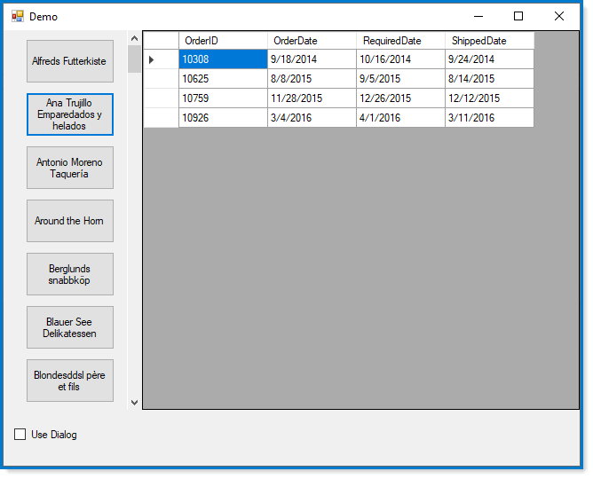

# About

Demonstrates creating dynamic buttons with data using Microsoft SQL-Server, C#, .NET Framework 4.8.

---


---



---

# Core code

```csharp
public class CreateButtons
{
    /// <summary>
    /// Size to create each button
    /// </summary>
    /// <returns></returns>
    public Size ButtonSize { get; set; }
    /// <summary>
    /// Provides a reference to your buttons
    /// </summary>
    /// <returns></returns>
    public List<Button> Buttons { get; set; }
    /// <summary>
    /// base name of buttone e.g. btn, cmd etc.
    /// </summary>
    /// <returns></returns>
    public string ButtonBaseName { get; set; }
    /// <summary>
    /// Used to spread out buttons
    /// </summary>
    /// <returns></returns>
    public int Base { get; set; }
    public int BaseAddition { get; set; }
    /// <summary>
    /// Count of buttons
    /// </summary>
    /// <returns></returns>
    public int ButtonCount { get; set; }
    /// <summary>
    /// control to place buttons onto
    /// </summary>
    /// <returns></returns>
    public Control ParentControl { get; set; }
    /// <summary>
    /// Used here to push the current primary key back to the caller
    /// </summary>
    public EventHandler<IdentifierButtonEventArgs> ClickedHandler;
    /// <summary>
    /// constructor for CreateButtonsFromTable
    /// </summary>
    /// <param name="ParentControl"></param>
    /// <param name="BaseName"></param>
    public CreateButtons(Control ParentControl, string BaseName)
    {
        this.ParentControl = ParentControl;
        this.ButtonBaseName = BaseName;
    }
    /// <summary>
    /// Creates buttons with their names taken from fieldName with a prefix of Me.ButtonBaseName
    /// and sets the tag of each button from Identifier which would be the primary key of a DataRow.
    /// </summary>
    /// <param name="sender"></param>
    /// <param name="Identifier">used to set tag for each button</param>
    /// <param name="fieldName">used to set button text and button name</param>
    public void CreateButtonsFromTable(DataTable sender, string Identifier, string fieldName)
    {

        Buttons = new List<Button>();

        ButtonCount = sender.Rows.Count - 1;

        sender.AsEnumerable().Select((row) => new
            {
                ID = Convert.ToInt32(row[Identifier]),
                Name = row[fieldName].ToString()
            })
            .ToList().ForEach((item) => 
                {
                    Button b = new Button
                    {
                        Name = string.Concat(ButtonBaseName, item.Name),
                        Text = item.Name,
                        Tag = item.ID,
                        Size = ButtonSize,
                        Location = new Point(25, this.Base),
                        Parent = ParentControl,
                        Visible = true
                    };

            b.Click += (object s, EventArgs e) => {
                ClickedHandler(s, new IdentifierButtonEventArgs(Convert.ToInt32(((Button)s).Tag)));
            };

            ParentControl.Controls.Add(b);
            Buttons.Add(b);
            Base += BaseAddition;
        });
    }
    /// <summary>
    /// Create buttons based on Me.ButtonCount
    /// </summary>
    public CreateButtons()
    {
        Buttons = Enumerable.Range(0, ButtonCount).Select((Indexer) => {

            Button b = new Button
            {
                Name = string.Concat(ButtonBaseName, Indexer + 1),
                Text = (Indexer + 1).ToString(),
                Size = this.ButtonSize,
                Location = new Point(25, Base),
                Parent = 
                ParentControl,
                Visible = true
            };

            // alternate
            //b.Click += new EventHandler(buttonIntregate);

            b.Click += (object sender, EventArgs e) =>
            {
                Button tb = (Button)sender;
                if (tb.Name == ButtonBaseName + "1")
                {
                    tb.Text = "Got it";
                }
                else
                {
                    MessageBox.Show(tb.Name);
                }
            };

            this.ParentControl.Controls.Add(b);

            Base += BaseAddition;

            return b;

        }).ToList();
    }
}
```